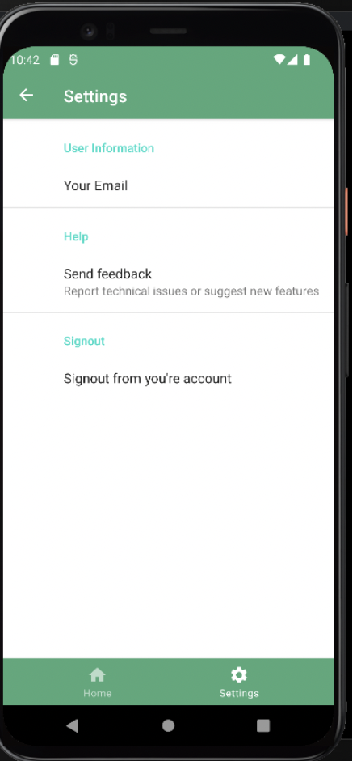

# TerraEyes

Demonstration of app:
https://www.youtube.com/watch?v=Z2ItRI6-z3M

### Requirements

- [x] Som bruger vil jeg aflæse temperaturen i terrariet, så jeg kan se den seneste aflæste temperatur.
- [x] Som bruger vil jeg have besked hvis temperaturen i terrariet falder uden for en sat rækkevidde, så jeg kan reagere på forkert temperatur
- [ ] Som bruger vil jeg have besked hvis luftfugtigheden i terrariet falder uden for en sat rækkevidde, så jeg kan reagere på forkert fugtighed
- [x] Som bruger vil jeg indstille kritiske niveauer for temperatur, luftfugtighed og CO2 for at bestemme, hvornår jeg får besked om kritiske niveauer. 
- [x] Som bruger vil jeg se en oversigt over den seneste temperatur-, luftfugtighed- og CO2-måling, så jeg kan se øjebliksbilledet for mit terrarie
- [x] Som bruger vil jeg fodre mit dyr uden at være fysisk tilstede, så jeg har muligheden for at være hjemmefra i længere perioder.
- [ ] Som bruger vil jeg have besked, hvis CO2-niveauet i terrariet overskrider en sat rækkevidde, så jeg kan reagere på forhøjede CO2-niveauer
- [x] Som bruger vil jeg se en oversigt over de seneste målinger af temperatur i terrariet, så jeg kan se udviklingen over tid.
- [x] Som bruger vil jeg se en oversigt over de seneste målinger af luftfugtighed i terrariet, så jeg kan se udviklingen over tid.
- [x] Som bruger vil jeg se en oversigt over de seneste målinger af CO2 niveau i terrariet, så jeg kan se udviklingen over tid.
- [x] Som bruger vil jeg koble flere terrarier til systemet og have individuelle målinger for dem, så jeg kan overvåge flere terrarier sideløbende. 
- [x] Som bruger vil jeg kunne tilføje dyr til systemet, så jeg kan holde styr på hvor mange dyr, jeg har i mit terrarie.
- [ ] Som bruger vil jeg kunne slette et dyr fra systemet, så jeg har mulighed for at fjerne et dyr fra et terrarie. 
- [x] Som bruger vil jeg kunne redigere et dyr, så jeg kan opdatere info for det pågældende dyr.
- [ ] Som bruger vil jeg kunne slette et terrarie, så jeg kan skille et terrarium fra et dyr.
- [x] Som bruger vil jeg kunne redigere et terrarie, så jeg kan opdatere grænseværdierne for klimaforholdet i terrariet.

- [x] The application must retrieve, parse and display relevant data from a webservice
- [x] The application must have a responsive user interface
- [x] The application should include various options for visualizing sensor data
- [x] The application should work without a network connection, persisting data locally on the device
- [x] All customer related features of the system should be manageable from the Android application.
- [x] The application could provide an onboarding experience for new users
- [x] The application could have a settings menu
- [x] The application could utilize authentication to sign in

- [x] The application must be under version control for the entire development process
- [x] The application must be developed using the official Android framework
- [x] The application should be developed with Java
- [x] The application should follow the Google Material Design guidelines
- [x] The source code should be structured using an architectural pattern (MVVM is advised)

# Screenshots

### SignUp:

### Login:

### AddTerrarium:

### TerrariumList:

### EditTerrarium:

### DataVisualisation:

### AddAnimal:

### AnimalList:

### UpdatePet:

### FeedPet:

### Setting:

